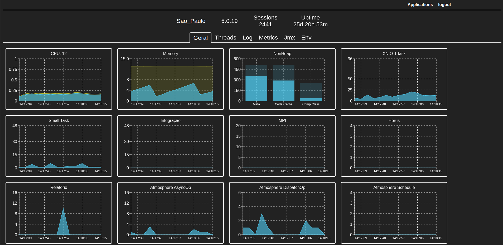
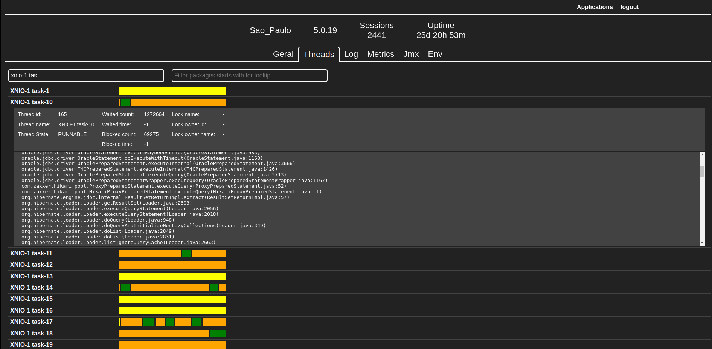
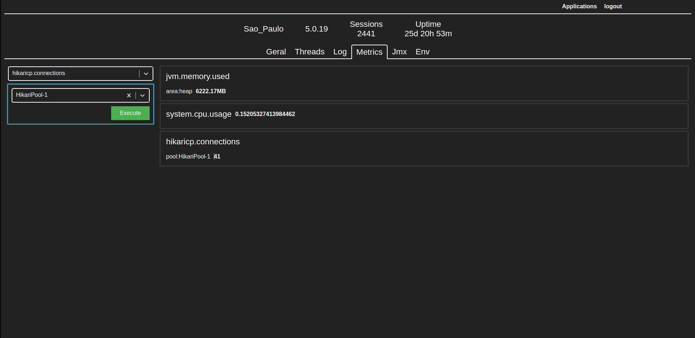
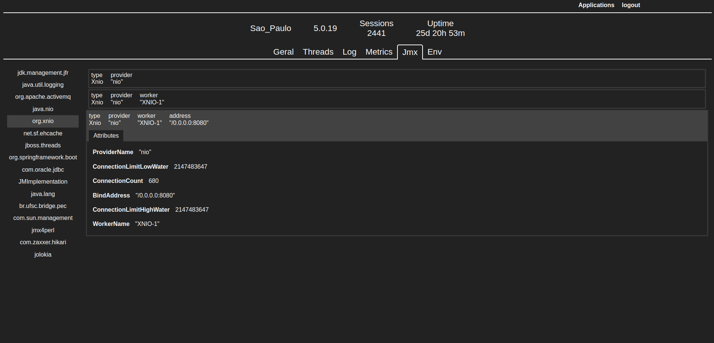

# Spring Actuator Monitoring App
This is an application built with Express, React, and TypeScript that connects to Spring Actuator systems and monitors everything that Spring Actuator offers.

## Build Instructions
1. Build the Backend Folder
To build the backend folder, follow these steps:

- Navigate to the backend folder.
- Install dependencies: `yarn install`
- Build the application: `yarn build`
2. Build the Frontend Folder
To build the frontend folder, follow these steps:

- Navigate to the frontend folder.
- Install dependencies: `yarn install`
- Build the application: `yarn build`
3. Docker Compose Up
To run the application with Docker Compose, follow these steps:

- Ensure that Docker and Docker Compose are installed on your machine.
- Navigate to the root directory of the project.
- Run the following command: docker-compose up

## Features
The Spring Actuator Monitoring App provides the following features:

- View Health Indicators: View health indicators provided by Spring Actuator.
- View Metrics: View metrics provided by Spring Actuator.
- View Environment Properties: View environment properties provided by Spring Actuator.
- View Loggers: View loggers provided by Spring Actuator.
- View Jmx: View Jmx beans provided by Spring Actuator.
- View Threads: View all threads of the client system.

## Images

